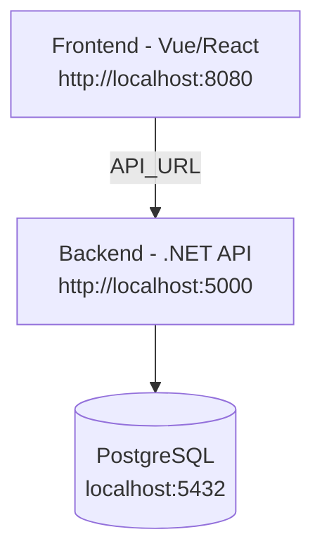

# Banco App 🏦

Este proyecto contiene el **BackEnd** en .NET, el **FrontEnd** en Vue/React y una base de datos **PostgreSQL**, todos orquestados con **Docker Compose**.

---

## 📦 Requisitos previos
- [Docker Desktop](https://www.docker.com/products/docker-desktop/) instalado y corriendo.
- [Git](https://git-scm.com/) para clonar y manejar el repositorio.

---

## 🚀 Ejecución con Docker Compose

1. Clonar el repositorio:
   ```bash
   [git clone https://github.com/tu-usuario/tu-repo.git](https://github.com/AdrianAtenciaCaly/Bank.git)
   cd tu-repo
   ```

2. Levantar los contenedores:
   ```bash
   docker-compose up --build
   ```

3. Acceder a los servicios:

   - **Backend (Swagger .NET API)**:  
     👉 [http://localhost:5000/swagger/index.html](http://localhost:5000/swagger/index.html)

   - **Frontend (Vue/React)**:  
     👉 [http://localhost:8080](http://localhost:8080)

   - **Base de datos Postgres** (opcional, por cliente tipo DBeaver/pgAdmin):  
     ```
     Host: localhost
     Puerto: 5432
     Usuario: banco
     Contraseña: banco123
     Base de datos: banco_db
     ```

---

## 🛠️ Estructura de carpetas

```
C:\CodeTemp
├── BackEnd/           # Proyecto .NET 7 API
│   └── BancoApi/      # Contiene el Dockerfile del backend
├── FrontEnd/          # Proyecto frontend (Vue o React)
│   └── banco-app/     # Contiene el Dockerfile del frontend
├── docker-compose.yml # Orquestador de todos los servicios
└── README.md          # Este archivo
```

---

## 🔄 Comandos útiles

- Detener los contenedores:
  ```bash
  docker-compose down
  ```

- Ver logs en tiempo real:
  ```bash
  docker-compose logs -f
  ```

- Reconstruir imágenes desde cero:
  ```bash
  docker-compose build --no-cache
  ```

---

## 📊 Diagrama de arquitectura (Mermaid)



---

## ✅ Notas importantes

- El **frontend** obtiene la URL del backend desde la variable de entorno `API_URL` configurada en el `docker-compose.yml`.
- El **backend** está expuesto en el puerto `5000` y mapea internamente al puerto `80` del contenedor.
- La **base de datos** persiste los datos gracias al volumen `db_data`.
